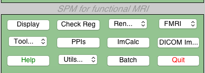
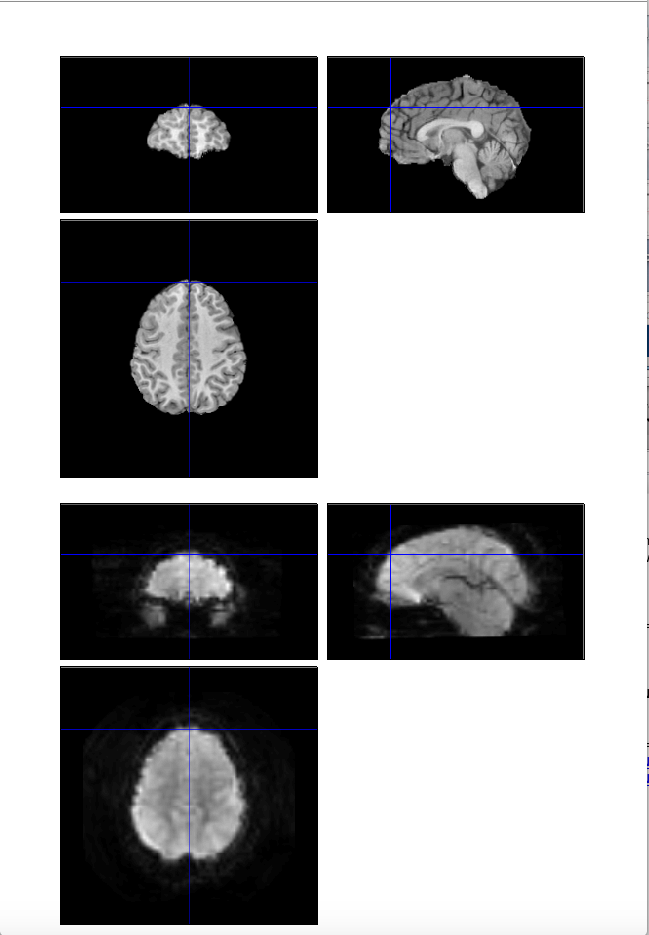
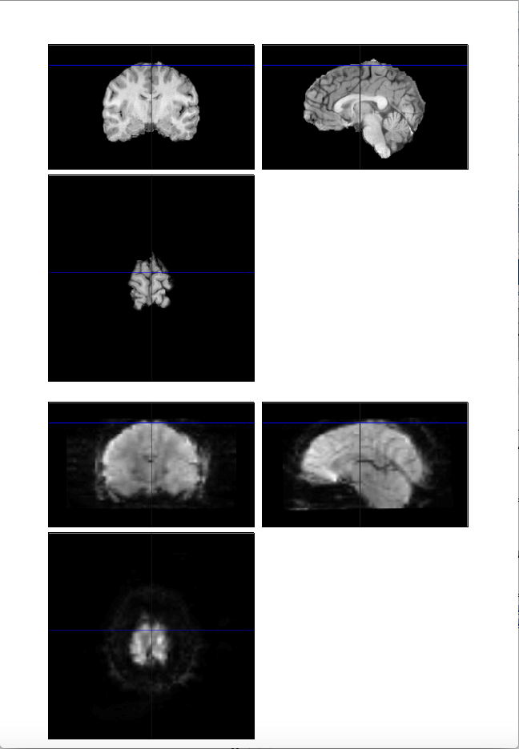
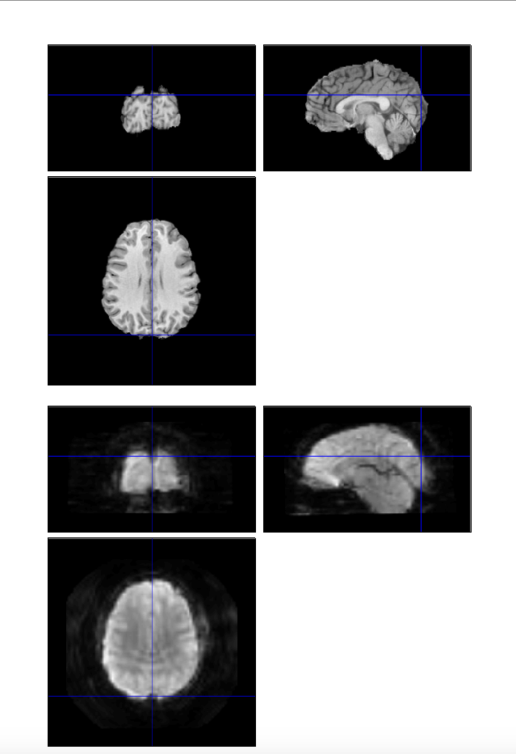

# Checking Coregistration
- Protocol Developed by Kristen Stauffer
- Webpage Developed by Andie Bulbin

## To open SPM12
1. Open matlab on computer with the brain images
1. Enter into matlab command window
- $ addpath(genpath(‘PATH TO SPM12’))
- $ cd /PATH FOR IMAGING DATA DIRECTORY
- $ spm fmri

SPM12 should automatically open

## To open image
1. Click the "Check Reg" button on the green window that pops up

2. Click on the desired participant
3. Click "anatomy" then "t1spgr_110sl" then "eht1spgr_110.nii,1"
4. Click the ".." on the left side of the window to return until seeing "func", then click that. Next click "faces", then "run_01", then "rtrun_or.nii,1"
5. Click "done"

## To check coregistration
1. Click around the periphery of the top right brain image that pops up, watching to see if each click aligns with the periphery of the bottom right image.

### Examples

2. Open excel recording spreadsheet to enter the results of each participant's coregistration
3. To start a new participant, exit out of the window with the brain images, click "Check Reg" again, and repeat the same steps
